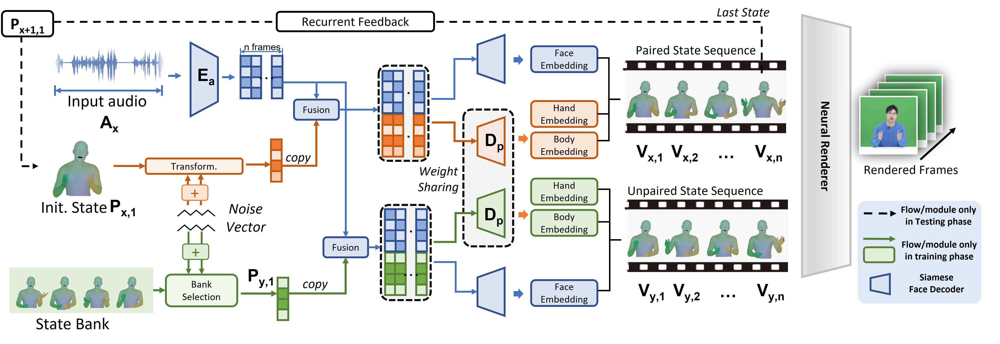

# DR^2: Disentangled Recurrent Representation Learning for Data-efficient Speech Video Synthesis



## PyTorch implementation:


## Environment Setup
- Python environment 
```
conda create -n Drr python=3.7
conda activate Drr
```
- ffmpeg
```
sudo apt-get install ffmpeg
```
- python packages
```
pip install -r requirements.txt
```
## Quick Test
1. Audio preprocessing
```
cd audio2gesture
python audio_preprocessing.py
```
2. Generate SMPLX params with the testing audio:
```
cd audio2gesture
python test_pose2.py  (--audioname <testaudio> --checkname <checkpoint>)[Add when needed]
```
3. Rendering results (The results are in `examples/rendering/`)
```
python render-smplx-netparams.py 
```


